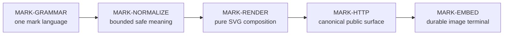

# Mark capability DAG

This is the stable product-owned dependency graph for the Mark destination in
[`vision.md`](vision.md). Cite the `MARK-*` IDs. This file owns capability
boundaries, hard edges, and falsifiable done-when predicates; it does not record
PR status, release state, metrics, or a feature backlog.

| This file is | This file is not |
| --- | --- |
| Product capability architecture | A second API reference or source inventory |
| Hard prerequisites for the embeddable customer outcome | A sequence imposed by staffing, CI, or deployment |
| Done-when and fails-if oracles | Proof that a checkout, artifact, or host passes |
| A boundary against alternate render authorities | A claim that candidate-only behavior has landed |

## Product boundary

Mark owns one URL-to-SVG grammar and its deterministic render path. Generic
build, deployment, routing, and runtime availability belong to the runtime
platform. An unavailable platform blocks the shipped observation for
`MARK-EMBED`; it does not authorize a second Mark renderer, host-specific
grammar, or product-local deployment mechanism.

## Graph

## Registry

| ID | Capability | Hard dependencies |
| --- | --- | --- |
| MARK-GRAMMAR | One composable Mark language | — |
| MARK-NORMALIZE | Bounded, total, safe input meaning | MARK-GRAMMAR |
| MARK-RENDER | Pure deterministic SVG composition | MARK-NORMALIZE |
| MARK-HTTP | Canonical HTTP, catalog, and studio surface | MARK-RENDER |
| MARK-EMBED | Artifact-bound embeddable customer terminal | MARK-HTTP |

## Node cards

### MARK-GRAMMAR — one composable Mark language

- **Locators:** `src/capabilities/mark/domain/spec.rs`,
  `src/capabilities/mark/domain/catalog.rs`,
  `docs/adr/ADR-0003-one-grammar-end-state.md`,
  `docs/adr/ADR-0004-neutral-ux-redesign.md`.
- **Done when:** One typed vocabulary expresses form × art × paint × content ×
  geometry × motion. Canonical forms are `hero`, `pill`, `strip`, `profile`,
  and `deploy`; form-specific fields remain compositions of this grammar.
  Catalog names are neutral, content comes from the request, and every public
  discovery surface projects the same vocabulary.
- **Fails if:** A form gains an independent query dialect or renderer; a theme
  or content default embeds a person or company identity; catalog and parser
  disagree; or clock, upstream data, account state, or secrets enter the mark
  specification.

### MARK-NORMALIZE — bounded, total, safe input meaning

- **Locators:** `src/capabilities/mark/interfaces/http.rs`,
  `src/capabilities/mark/domain/{catalog,color,svg}.rs`,
  `src/capabilities/mark/application/hero.rs`, `tests/clean_break.rs`, and
  `tests/http_contracts.rs`.
- **Done when:** Every syntactically accepted input resolves to one bounded
  `MarkSpec` meaning before it can become SVG. Unknown forms and art, invalid
  paint, text and list limits, geometry ranges, boolean aliases, and motion
  aliases follow the documented total normalization rules. Floating-point
  geometry and custom-gradient offsets must be finite; offsets must be within
  `0..=100`; non-finite or out-of-range values fall back without serializing
  `NaN`, `inf`, or an invalid percentage. User text is capped and escaped, and
  only validated tokens reach SVG attributes.
- **Fails if:** Raw request text becomes an SVG attribute; a renderer invents
  different defaults; malformed numeric state survives into output; input size
  can amplify render work without the declared cap; or invalid input selects an
  error-SVG path instead of the one total grammar.

### MARK-RENDER — pure deterministic SVG composition

- **Locators:** `src/capabilities/mark/application/`,
  `src/capabilities/mark/domain/{color,motion,shapes,svg}.rs`,
  `tests/mark_smoke.rs`, and `tests/architecture_boundaries.rs`.
- **Done when:** The one dispatcher renders all five forms as valid SVG and
  preserves the normalized axes each form supports. Repeating a complete spec
  produces byte-identical output. Rendering performs no clock read, network
  request, secret lookup, process-state lookup, or mutable write; all visible
  values derive from the normalized spec and static product vocabulary.
- **Fails if:** Another render kernel becomes authoritative; a form silently
  ignores a promised shared axis; the same complete spec can change without a
  source change; SVG contains non-finite geometry; or rendering depends on a
  mutable/external value.

### MARK-HTTP — canonical HTTP, catalog, and studio surface

- **Locators:** `src/interfaces/http/`,
  `src/capabilities/mark/interfaces/http.rs`, `static/index.html`, and
  `tests/http_contracts.rs`.
- **Done when:** `GET /api/v1/mark` and `GET /api/v1/mark/{form}` expose the
  complete render grammar, while `/badge/{label}-{message}-{color}` is only a
  documented pill shorthand. SVG responses have the declared content type,
  CSP, nosniff, CORS, and normalized-motion cache policy. `/api/v1/catalog`
  projects the same vocabulary and the studio composes canonical URLs from it.
  Retired capability routes remain unavailable.
- **Fails if:** A legacy path or studio-only field becomes a second product
  contract; headers allow active user content; cache policy depends on raw
  rather than normalized motion; the catalog drifts from the parser; or HTTP
  bypasses `MARK-NORMALIZE` / `MARK-RENDER`.

### MARK-EMBED — artifact-bound embeddable customer terminal

- **Locators:** [`vision.md`](vision.md#exact-shipped-oracle), `README.md`,
  `src/interfaces/http/health.rs`, `tests/http_contracts.rs`, and
  `tests/clean_break.rs`.
- **Done when:** A Markdown or HTML image URL on the canonical host resolves
  from an admitted artifact to the intended form as HTTP 200 SVG, and the same
  exact instance passes every observation in the vision's shipped oracle:
  revision binding, five forms, badge shorthand, byte determinism, hostile and
  non-finite input safety, contract headers, grammar projection, and retired
  route absence.
- **Fails if:** Health alone is treated as capability proof; source tests are
  presented as shipped behavior; the observed host revision differs from the
  admitted artifact; any oracle request reaches a different render authority;
  or consumers need a build step, account, mutable asset, or upstream service
  for an ordinary Mark embed.
