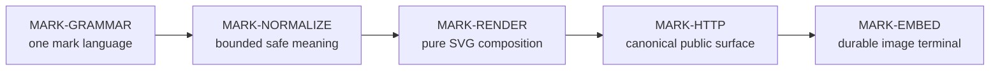

# Mark identity graph

This is the durable identity graph for the Mark destination in
[`vision.md`](vision.md). Cite the `MARK-*` IDs. This file owns identities,
fates, truth-edges, and falsifiable done-when oracles; it does not record
PR status, release state, metrics, or a feature backlog.

Conversion to this shape does not change destination identities, edges, or
oracles. Fate for every identity below is `live`.

| This file is | This file is not |
| --- | --- |
| The identity graph (`ID \| Identity \| Fate \| Depends on \| Done when`) | A PRD, roadmap, or vision restatement |
| One colloquial name, one row, one fate (`live`, `dead`, or `rename-to:<ID>`) | Proof that a checkout, artifact, or host passes |
| Hard prerequisites for the embeddable customer outcome | A sequence imposed by staffing, CI, or deployment |
| A boundary against alternate render authorities | A claim that candidate-only behavior has landed |

## Product boundary

Mark owns one URL-to-SVG grammar and its deterministic render path. Generic
build, deployment, routing, and runtime availability belong to the runtime
platform. An unavailable platform blocks the shipped observation for
`MARK-EMBED`; it does not authorize a second Mark renderer, host-specific
grammar, or product-local deployment mechanism.

Grammar forms (`hero`, `pill`, `strip`, `profile`, `deploy`) are compositions
of `MARK-GRAMMAR`, not extra identities. Catalog and studio project that
grammar under `MARK-HTTP`; neither is a second rendering authority.
Predecessor capability names and the retired `identity` form are not rows
here. Vision boundaries (live GitHub cards, clocks, upstream data) stay out of
this graph; they are not `dead` identities.

## Graph

The table is the authority. The picture uses the same IDs and the same
Depends-on edges. A picture that omits or invents an edge is a defect.

## Registry

| ID | Identity | Fate | Depends on | Done when |
| --- | --- | --- | --- | --- |
| MARK-GRAMMAR | One composable Mark language | live | — | One typed vocabulary expresses form × art × paint × content × geometry × motion. Canonical forms are `hero`, `pill`, `strip`, `profile`, and `deploy`; form-specific fields remain compositions of this grammar. Catalog names are neutral, content comes from the request, and every public discovery surface projects the same vocabulary. A form with an independent query dialect or renderer, a theme or content default that embeds a person or company identity, catalog/parser disagreement, or clock, upstream data, account state, or secrets in the mark specification fails the row. |
| MARK-NORMALIZE | Bounded, total, safe input meaning | live | MARK-GRAMMAR | Every syntactically accepted input resolves to one bounded `MarkSpec` meaning before it can become SVG. Unknown forms and art, invalid paint, text and list limits, geometry ranges, boolean aliases, and motion aliases follow the documented total normalization rules. Floating-point geometry and custom-gradient offsets must be finite; offsets must be within `0..=100`; non-finite or out-of-range values normalize, clamp, or fall back without serializing `NaN`, `inf`, or an invalid percentage. User text is capped and escaped, and only validated tokens reach SVG attributes. Raw request text as an SVG attribute, a renderer inventing different defaults, malformed numeric state surviving into output, input size amplifying render work without the declared cap, or invalid input selecting an error-SVG path instead of the one total grammar fails the row. |
| MARK-RENDER | Pure deterministic SVG composition | live | MARK-NORMALIZE | The one dispatcher renders all five forms as valid SVG and preserves the normalized axes each form supports. Repeating a complete spec produces byte-identical output. Rendering performs no clock read, network request, secret lookup, process-state lookup, or mutable write; all visible values derive from the normalized spec and static product vocabulary. Another authoritative render kernel, a form that silently ignores a promised shared axis, the same complete spec changing without a source change, SVG with non-finite geometry, or rendering that depends on a mutable/external value fails the row. |
| MARK-HTTP | Canonical HTTP, catalog, and studio surface | live | MARK-RENDER | `GET /api/v1/mark` and `GET /api/v1/mark/{form}` expose the complete render grammar, while `/badge/{label}-{message}-{color}` is only a documented pill shorthand. SVG responses have the declared content type, CSP, nosniff, CORS, and normalized-motion cache policy. `/api/v1/catalog` projects the same vocabulary and the studio composes canonical URLs from it. Retired capability routes remain unavailable. A legacy path or studio-only field becoming a second product contract, headers allowing active user content, cache policy depending on raw rather than normalized motion, catalog drift from the parser, or HTTP bypassing `MARK-NORMALIZE` / `MARK-RENDER` fails the row. |
| MARK-EMBED | Artifact-bound embeddable customer terminal | live | MARK-HTTP | A Markdown or HTML image URL on the canonical host resolves from an admitted artifact to the intended form as HTTP 200 SVG, and the same exact instance passes every observation in the vision's shipped oracle: revision binding, five forms, badge shorthand, byte determinism, hostile and non-finite input safety, contract headers, grammar projection, and retired route absence. Treating health alone as identity proof, presenting source tests as shipped behavior, observing a host revision that differs from the admitted artifact, reaching a different render authority, or requiring a build step, account, mutable asset, or upstream service for an ordinary Mark embed fails the row. |

## Source grounding

- `MARK-GRAMMAR`: `src/capabilities/mark/domain/spec.rs`,
  `src/capabilities/mark/domain/catalog.rs`,
  `docs/adr/ADR-0003-one-grammar-end-state.md`,
  `docs/adr/ADR-0004-neutral-ux-redesign.md`.
- `MARK-NORMALIZE`: `src/capabilities/mark/interfaces/http.rs`,
  `src/capabilities/mark/domain/{catalog,color,svg}.rs`,
  `src/capabilities/mark/application/hero.rs`, `tests/clean_break.rs`, and
  `tests/http_contracts.rs`.
- `MARK-RENDER`: `src/capabilities/mark/application/`,
  `src/capabilities/mark/domain/{color,motion,shapes,svg}.rs`,
  `tests/mark_smoke.rs`, and `tests/architecture_boundaries.rs`.
- `MARK-HTTP`: `src/interfaces/http/`,
  `src/capabilities/mark/interfaces/http.rs`, `static/index.html`, and
  `tests/http_contracts.rs`.
- `MARK-EMBED`: [`vision.md`](vision.md#exact-shipped-oracle), `README.md`,
  `src/interfaces/http/health.rs`, `tests/http_contracts.rs`, and
  `tests/clean_break.rs`.

Locators are evidence homes, not substitutes for the oracle.

## Reading rules

1. One colloquial name has one row and one fate (`live`, `dead`, or
   `rename-to:<ID>`).
2. `Depends on` is a hard edge, not a scheduling preference.
3. `Done when` is an oracle, not a statement about this checkout.
4. A source test, admitted artifact, and live host observation establish
   different layers and are not interchangeable.
5. Current work and conflicts belong on the product PR, not in this graph.
